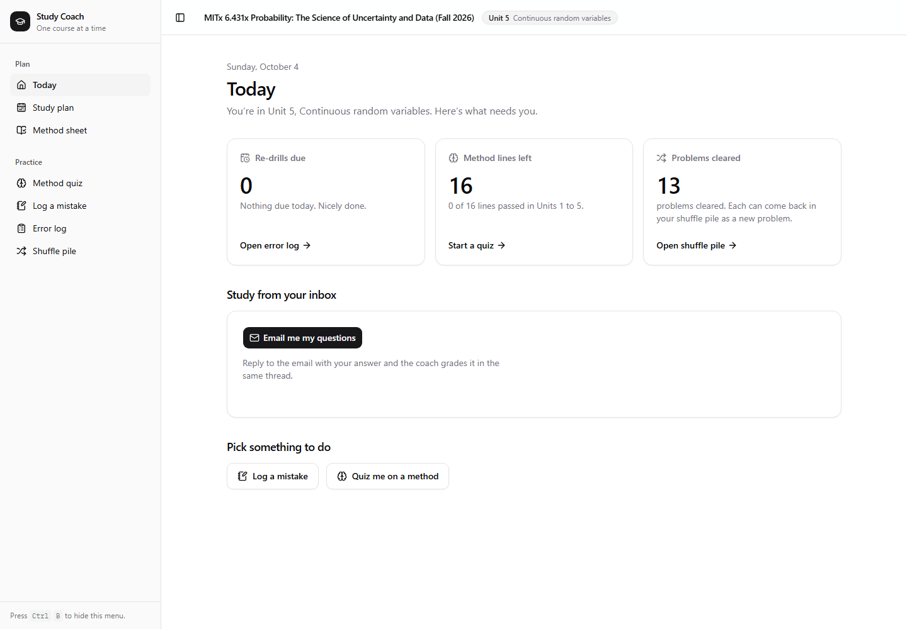
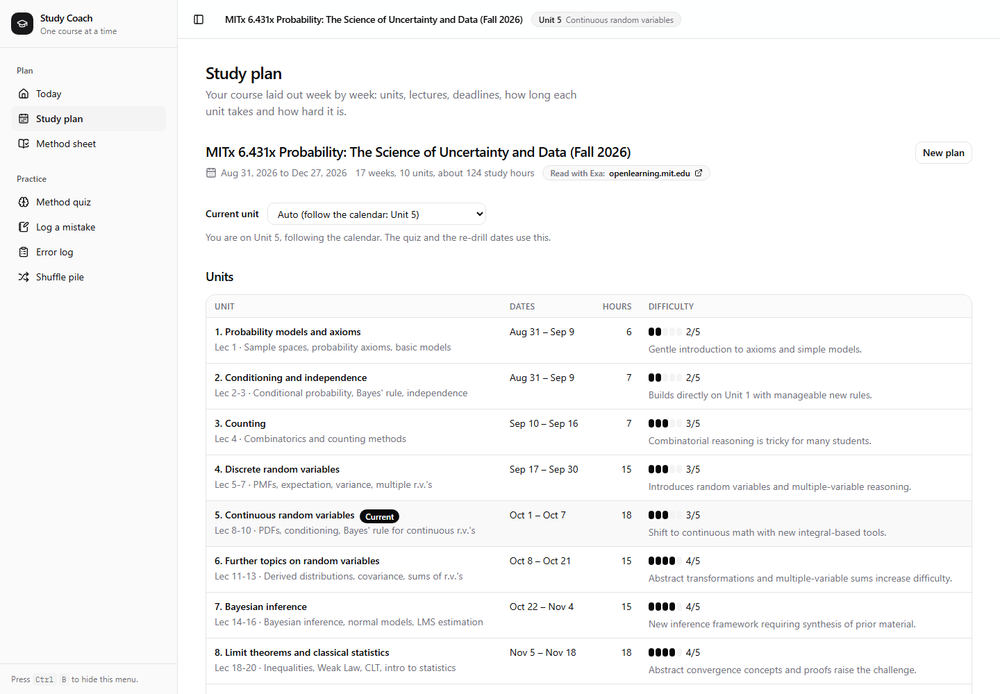
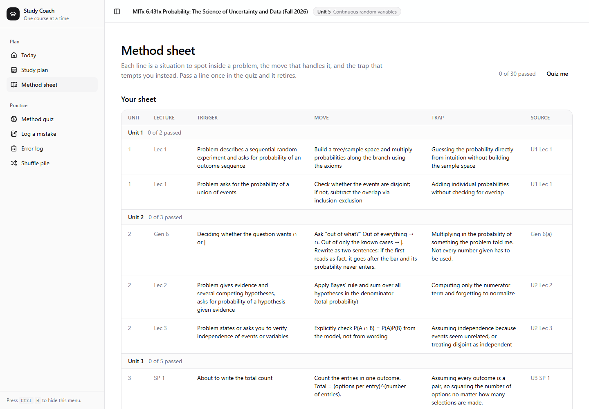
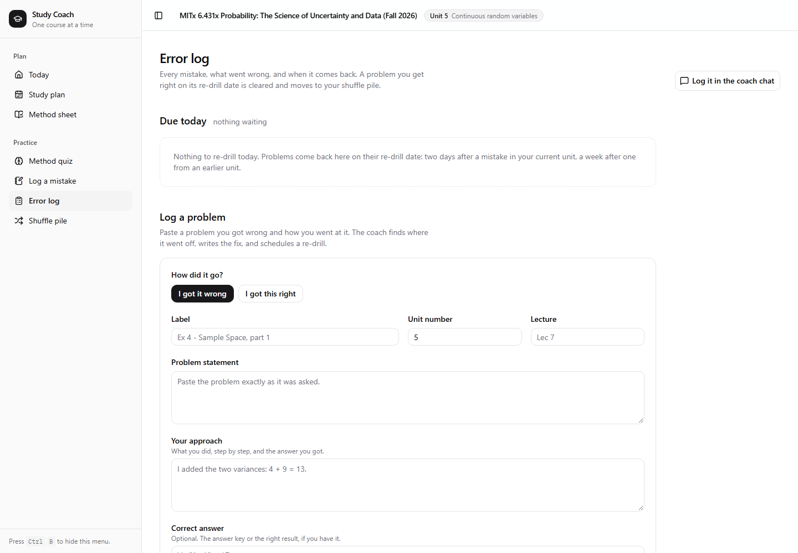

# Study Coach

A personal study coach for hard quantitative courses. Give it your syllabus and it lays out the
term week by week; log a problem you got wrong and it tells you where your reasoning broke, writes
the move you should have made, and brings the problem back on a re-drill date; then it quizzes you
on those moves and emails you what's due. Built for my real course, MITx 6.431x (Probability,
Fall 2026).

**Live:** https://study-coach-b3ywk.sprites.app · **License:** MIT

| Today | Study plan (Exa-read, today = Unit 5) |
| --- | --- |
|  |  |
| **Method sheet** (trigger → move → trap) | **Error log** (re-drills +2 / +7 days) |
|  |  |

## What it does

| Part | What happens |
| --- | --- |
| **Study plan** | Reads the syllabus (pasted, or the course website via Exa) and builds a week-by-week plan: units, lectures, deadlines, study hours and difficulty per unit. The current unit follows the calendar, with a manual override. |
| **Error log** | You paste a problem you missed and how you approached it. The coach diagnoses it (concept gap, computational slip, wrong tool, misread setup), writes the correct approach and a one-line lesson, and sets a re-drill date: +2 days for the unit you're on, +7 days for an earlier unit. |
| **Method sheet** | Rows of *trigger → move → trap*. Every non-slip mistake drafts a new row, which you approve or reject. A row must be actionable inside a problem ("variance of a SUM: check independence first"), never a fact. pgvector blocks near-duplicates. |
| **Method quiz** | Random questions from units you've reached. Each is a fresh scenario that fires a trigger; you answer with the move; one pass retires the row. |
| **Shuffle pile** | Cleared problems come back as new, similar problems. Pass and they're done; miss and they return to the error log. |
| **Email coach** | The coach has its own inbox. It emails you what's due; you reply with your answer; it grades the reply in the same thread. Only your address is accepted. |

## How each tool does real work

| Tool | Job in Study Coach |
| --- | --- |
| **Neon Postgres** | All state, and the agents' shared memory: plans, method sheet, error log, attempts, shuffle pile, email threads. Agents never call each other; they read and write tables. **pgvector** stores method-row embeddings to block duplicates. |
| **Neon AI Gateway** | Every model call: planning, diagnosis, question writing, grading, problem generation, embeddings, and the coach chat. Completions stream, so long generations don't hit timeouts. |
| **Exa** | Reads the course website from a URL or a course name, and searches the same site when the landing page is thin. |
| **AgentMail** | The coach's own inbox (`study-coach@agentmail.to`): sends what's due, receives your reply by webhook, grades it, answers in-thread. |
| **Fly.io Sprite** | The app lives on a Sprite as a wake-on-request service: it sleeps when idle and wakes on a page view or an email webhook. `scripts/deploy-sprite.sh` deploys it in one command. |
| **assistant-ui** | The quiz, log and shuffle chats, with custom tool cards (question, grade, diagnosis with approve/reject, shuffle problem) instead of raw JSON. |
| **CodeRabbit** | Reviewed six of the seven feature pull requests: 22 inline comments, each answered (fixed in a named commit, or skipped with the reason), with the fixes sent back through the same pipeline. |

## How it was built

A team of decoupled agents coordinated through this repo's issues and pull requests
(`docs/PLAN.md` is the shared spec):

```
orchestrator opens a task issue (spec + acceptance criteria + files it may touch)
  test writer   writes tests from the spec only, never from the code
  builder       implements in its own git worktree, never commits
gate            commits only if typecheck + every test pass, then opens the PR
CodeRabbit      reviews the PR
review agent    answers every CodeRabbit comment: fix (back to the builder) or skip (with the reason)
gate            re-runs the checks and merges
judge check     scores the work against what each judge cares about and files the gaps
```

Every feature landed through a pull request. CodeRabbit reviewed six of the seven, and each PR shows its
comments and the replies (fixed in a named commit, or skipped with the reason). The email coach (#16)
merged on green tests after CodeRabbit's hourly review allowance ran out, as its PR says:
[#8 core rules](https://github.com/tossedsalads-scrambledeggs/study-coach/pull/8) ·
[#13 planner + Exa](https://github.com/tossedsalads-scrambledeggs/study-coach/pull/13) ·
[#12 error coach](https://github.com/tossedsalads-scrambledeggs/study-coach/pull/12) ·
[#10 method quiz + sheet](https://github.com/tossedsalads-scrambledeggs/study-coach/pull/10) ·
[#15 shuffle pile](https://github.com/tossedsalads-scrambledeggs/study-coach/pull/15) ·
[#16 email coach](https://github.com/tossedsalads-scrambledeggs/study-coach/pull/16) ·
[#11 coach UI](https://github.com/tossedsalads-scrambledeggs/study-coach/pull/11).
Review caught real problems: half-written data on failure (now one transaction per write), raw
database errors reaching the browser, a Host-header SSRF in the chat's server-side calls, and a
re-drill race. The judge-check agent's scorecard is [issue #14](https://github.com/tossedsalads-scrambledeggs/study-coach/issues/14).

**451 tests** (`npm run check`): rules, route contracts and agent invariants, written by test agents from
the spec before or alongside the code.

## Run it

```bash
cp .env.example .env        # fill in Neon, AI Gateway, Exa, AgentMail keys
npm ci
npm run migrate             # creates the tables in your Neon database
npm run dev                 # http://localhost:3000
npm run check               # typecheck + tests
```

Deploy to a Fly.io Sprite: `scripts/deploy-sprite.sh study-coach`, then
`node scripts/mail-webhook.mjs https://<your-sprite-url>` to connect the inbox.

## Real vs seeded

- **Real:** the course is my actual MITx 6.431x Fall 2026 syllabus; the plan was generated by the app
  (Exa read the course page, the planner read the syllabus). The 14 error-log rows and 6 method-sheet
  rows in the demo are copied from my own study notebook; the other 24 method-sheet rows are starter
  lines the planner drafted from the syllabus. Every diagnosis, quiz question, grade,
  shuffle problem and email reply is generated live through the Neon AI Gateway.
- **Demo setup:** the public deployment runs with `DEMO_LOCK=1`, so visitors can't replace the course.
  One student, no login (every table hangs off a student id, so accounts are the next step).
- **Not built yet:** photo/PDF upload of problems, webhook signature verification, per-user accounts.
